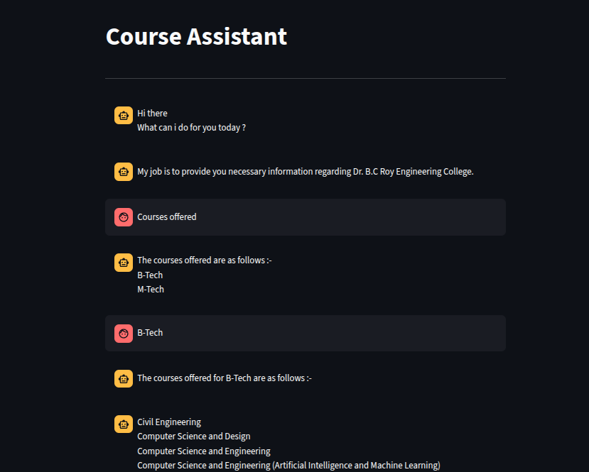

# Rule-Based-Chat-Bot

This is a simple **rule-based chatbot** implemented in **Python** using **Streamlit**.  
It provides information about Dr. B.C. Roy Engineering College, including courses offered, address, and contact information.  

The chatbot has a **typewriter effect** for responses and a **menu-driven interface**.

---

## Features

- Provides college information, address, and contact details.
- Shows courses offered for B.Tech and M.Tech streams.
- Interactive menu-driven interface with buttons.
- Typewriter effect for chatbot responses.
- Maintains conversation history during a session.

---

## Screenshots




---

## Installation

1. Clone the repository:
```bash
git clone https://github.com/yourusername/rule-based-chatbot-streamlit.git
cd rule-based-chatbot-streamlit
```
2. Create a virtual environment (optional but recommended):
   ```bash
   python -m venv venv
   source venv/bin/activate  # Linux/Mac
   venv\Scripts\activate     # Windows
3. Install dependencies:
  ```bash
  pip install streamlit
```
---
## Usage
Run the Streamlit app:
```bash
streamlit run rule_based_chatbot.py


